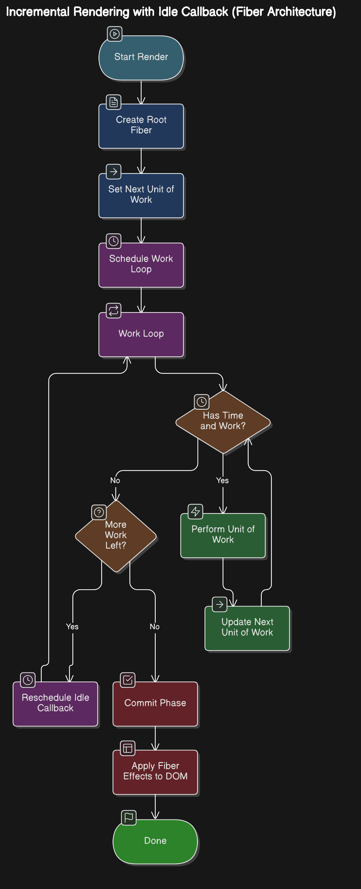
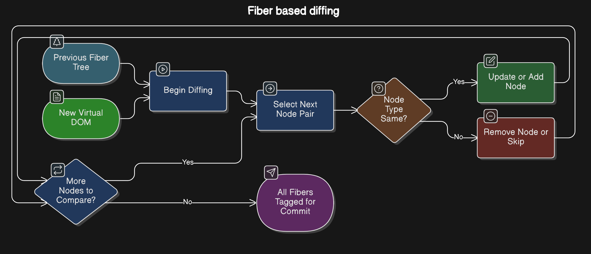
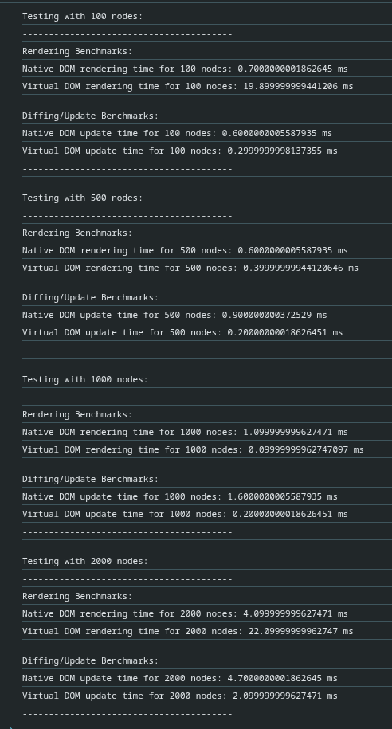

# RetaliateJS

A lightweight implementation of React's core features including Virtual DOM and Fiber Architecture.

## Table of Contents
- [Overview](#overview)
- [Features](#features)
- [Architecture](#architecture)
  - [Rendering Flow](#rendering-flow)
  - [Fiber Tree](#fiber-tree)
  - [Diffing Algorithm](#diffing-algorithm)
- [Performance](#performance)
  - [Benchmarks](#benchmarks)
  - [Virtual DOM vs Native DOM](#virtual-dom-vs-native-dom)
- [Getting Started](#getting-started)
- [Current Limitations](#current-limitations)

## Overview

RetaliateJS is my custom implementation of ReactJS, inspired by and built following [Rodrigo Pombo](https://twitter.com/pomber)'s [excellent guide](https://pomb.us/build-your-own-react/)

## Features

✅ JSX support through esbuild transpilation  
✅ Virtual DOM implementation  
✅ Fiber-based reconciliation  
✅ Incremental rendering with `requestIdleCallback`  
✅ Efficient diffing algorithm  
✅ Development server with hot reload  
✅ Production build support

- The flow of the rendering can be visualised as follows



- Here each node can have a parent, children, siblings which looks like this

```
        parent
        |
sibling-node-sibling
        |
        children
```

- [x] Diffing algorithm for efficiently updating dom without having to re-render whole thing,

- The flow of diffing can be visualised as follows



- Effect tages are assigned as follows,

        - If types match → "UPDATE"

        - If types don’t match:

                - If element exists → "PLACEMENT"

                - If old fiber exists → "DELETION"

## Current Limitations

- No state management system
- No side-effects handling (like React's useEffect)
- Limited event handling
- No component lifecycle methods

Future improvements will focus on implementing these features while maintaining the lightweight nature of the library.

## Getting Started

1. Clone the repository:
```bash
git clone <your-repo-url>
```

2. Install dependencies:
```bash
npm install
```

3. Start development server:
```bash
npm run dev
```

4. Build for production:
```bash
npm run build
```


## Performance

### Benchmarks
Our benchmarks compare RetaliateJS with native DOM operations across different tree sizes:



### Virtual DOM vs Native DOM
Key findings from our benchmarks:

- **Initial Rendering**: Native DOM is faster for small trees (< 250 nodes)
- **Large Trees**: Virtual DOM outperforms native DOM for trees larger than 250 nodes
- **Updates/Diffing**: Virtual DOM consistently outperforms native DOM for all tree sizes
- **Memory Usage**: Virtual DOM maintains better memory usage patterns for large trees

You can run your own benchmarks by:
1. Cloning the `benchmark` branch
2. Modifying the sizes array in `index.html`
3. Running the tests in your browser
